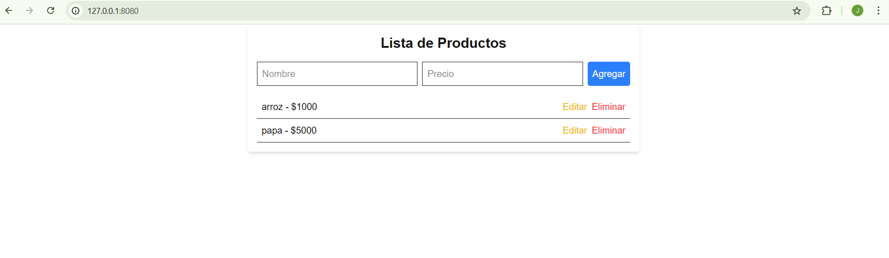
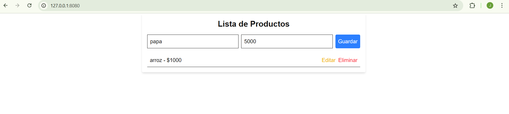
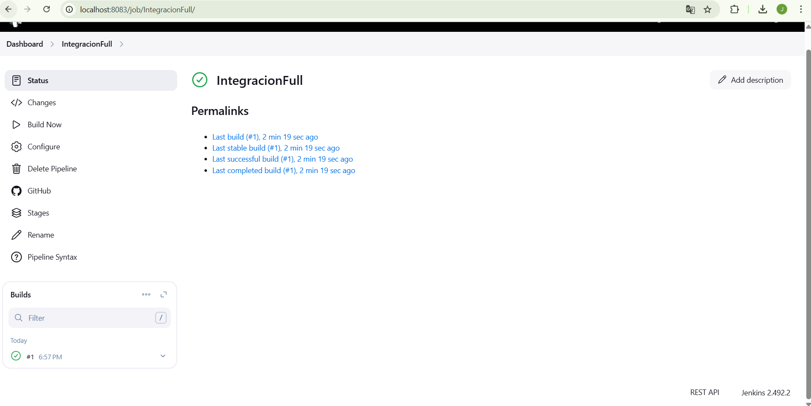
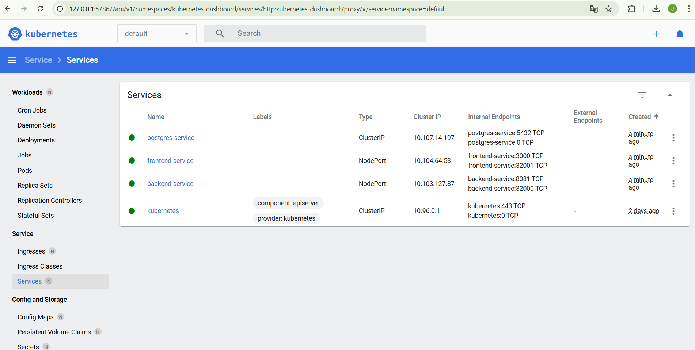

# Proyecto Integración Main

Este proyecto es una solución completa que incluye un **backend** desarrollado con Spring Boot y un **frontend** desarrollado con Next.js. Además, se utiliza Docker para la contenedorización, Kubernetes para el despliegue y Jenkins para la integración continua.

## Tabla de Contenidos

1. [Introducción](#introducción)
2. [Requisitos Previos](#requisitos-previos)
3. [Instalación](#instalación)
4. [Configuración](#configuración)
5. [Ejecución del Proyecto](#ejecución-del-proyecto)
6. [Estructura del Proyecto](#estructura-del-proyecto)
7. [Despliegue con Docker y Kubernetes](#despliegue-con-docker-y-kubernetes)
8. [Pipeline de Jenkins](#pipeline-de-jenkins)
9. [Tecnologías Utilizadas](#tecnologías-utilizadas)
10. [Contribuciones](#contribuciones)
11. [Licencia](#licencia)
12. [Evidencias](#evidencias)

## Introducción

El objetivo de este proyecto es proporcionar una solución integrada que combine un backend robusto con un frontend moderno, utilizando tecnologías de última generación para garantizar escalabilidad, rendimiento y facilidad de mantenimiento.

## Requisitos Previos

Antes de comenzar, asegúrate de tener instalado lo siguiente:

- [Node.js](https://nodejs.org) (versión 16 o superior)
- [Java 17](https://adoptium.net/) o superior
- [Docker](https://www.docker.com/) y [Docker Compose](https://docs.docker.com/compose/)
- [Kubernetes](https://kubernetes.io/) (opcional para despliegue)
- [Maven](https://maven.apache.org/) (opcional si no usas el wrapper incluido)
- [Jenkins](https://www.jenkins.io/) (opcional para CI/CD)

## Instalación

Clona el repositorio y navega a las carpetas del backend y frontend para instalar las dependencias:

```bash
# Clonar el repositorio
git clone https://github.com/jumunozdev/integracion.git
cd integracion-main

# Instalar dependencias del frontend
cd Frontend/front
npm install
# o
yarn install

# Instalar dependencias del backend
cd ../../Backend/apirest
mvnw.cmd clean install
```

## Configuración

### Variables de Entorno

Crea un archivo `.env` en la carpeta `Backend/apirest` basado en el archivo `env.template` proporcionado:

```plaintext
SPRING_DATASOURCE_URL=jdbc:postgresql://localhost:5432/database
SPRING_DATASOURCE_USERNAME=tu_usuario
SPRING_DATASOURCE_PASSWORD=tu_contraseña
SPRING_DATASOURCE_DB=nombre_base_datos
```

Para el frontend, asegúrate de configurar la variable `NEXT_PUBLIC_API_URL` en el archivo `docker-compose.yml` o directamente en tu entorno local:

```yaml
frontend:
  environment:
    NEXT_PUBLIC_API_URL: http://backend:8081
```

### Configuración de Docker

Asegúrate de que Docker esté ejecutándose y que los puertos 5432, 8081 y 3000 estén disponibles en tu máquina local.

## Ejecución del Proyecto

### Backend
Para iniciar el backend localmente:

```bash
cd Backend/apirest
mvnw.cmd spring-boot:run
```

El backend estará disponible en [http://localhost:8080](http://localhost:8080).

### Frontend
Para iniciar el frontend localmente:

```bash
cd Frontend/front
npm run dev
```

El frontend estará disponible en [http://localhost:3000](http://localhost:3000).

## Estructura del Proyecto

```
/integracion-main
├── /Backend
│   ├── /apirest
│   │   ├── /src
│   │   ├── /target
│   │   ├── Dockerfile
│   │   └── mvnw.cmd
├── /Frontend
│   ├── /front
│   │   ├── /app
│   │   ├── /public
│   │   ├── Dockerfile
│   │   └── package.json
├── docker-compose.yml
└── Jenkinsfile
```

- **Backend**: Contiene la API REST desarrollada con Spring Boot.
- **Frontend**: Contiene la aplicación web desarrollada con Next.js.
- **docker-compose.yml**: Configuración para ejecutar los servicios con Docker.
- **Jenkinsfile**: Pipeline para CI/CD.

## Despliegue con Docker y Kubernetes

### Docker Compose
Para ejecutar el proyecto con Docker Compose:

```bash
docker-compose up --build
```

Esto iniciará los servicios de PostgreSQL, el backend y el frontend. Los servicios estarán disponibles en:

- Backend: [http://localhost:8081](http://localhost:8081)
- Frontend: [http://localhost:3000](http://localhost:3000)

### Kubernetes
Para desplegar en Kubernetes, asegúrate de tener configurado `kubectl` y aplica los manifiestos:

```bash
kubectl apply -f k8s/
```

## Pipeline de Jenkins

El archivo `Jenkinsfile` define un pipeline para la integración continua. Este pipeline incluye las siguientes etapas:

1. **Clonar Repositorio**: Descarga el código fuente desde GitHub.
2. **Compilar Backend**: Construye el backend con Maven.
3. **Construir Imágenes Docker**: Crea imágenes Docker para el backend y el frontend.
4. **Subir a Registro**: Publica las imágenes en Docker Hub.
5. **Desplegar en Kubernetes**: Aplica los manifiestos de Kubernetes para desplegar los servicios.

### Configuración de Jenkins

- Configura las credenciales de Docker Hub en Jenkins con el ID `docker-hub-credentials`.
- Configura un archivo de configuración de Kubernetes en Jenkins con el ID `kube-config`.

## Tecnologías Utilizadas

- **Frontend**:
  - [Next.js](https://nextjs.org/)
  - [React](https://reactjs.org/)
  - [CSS/SCSS](https://sass-lang.com/)
  - [Axios](https://axios-http.com/)

- **Backend**:
  - [Spring Boot](https://spring.io/projects/spring-boot)
  - [PostgreSQL](https://www.postgresql.org/)
  - [Maven](https://maven.apache.org/)

- **Infraestructura**:
  - [Docker](https://www.docker.com/)
  - [Kubernetes](https://kubernetes.io/)
  - [Jenkins](https://www.jenkins.io/)

## Evidencias

A continuación, se presentan algunas capturas de pantalla y ejemplos visuales del funcionamiento del proyecto:


#### CRUD FUNCIONALIDAD





#### JENKIS


#### KUBERNETES


